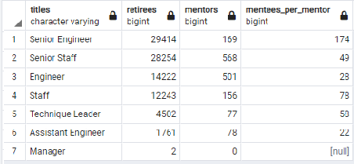
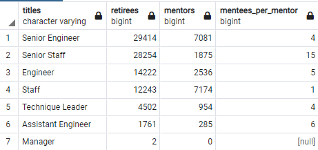

# Pewlett-Hackard-Analysis
Challenge 7 - SQL 

## Overview of the analysis

The Pewlett-Hackard is preparing for the large number of employees retiring. The organization need to understand number of many employees retiring and their current roles.  

The Pewlett-Hackard is considering to introduce mentorship program. Under the mentorship program, experienced and successful employees will be working part time role instead of retiring. They will mentor the newly hired employees. This analysis will help understand if the Mentorship Program is viable solution to mitigate the "silver tsunami".

## Results
Below are the key observations on employees eligible to retire and eligible for mentorship program. 

1. 133,776 titles are held by employees born between 1952 and 1955 and are eligible for the retirement
2. 90,398 unique titles are currently held by employees born between 1952 and 1955 are eligible are to retire
3. Of 90,398 employees eligible to retire, Senior Engineers, Senior Staff and Engineers make up 80% of retiring roles.  
    * 33% or 29,414 retirement eligible employees are Senior Engineers.
    * 31% or 28,254 retirement eligible employees are Senior Staffs.
    * 16% or 14,222 retirement eligible employees are Engineers.
4. 1,549 employees born in 1965 are eligible for mentorship program. 

##  Summary

There are currently 240,124 active employees. Out of that approximately 38% (90,398 employees) will be retiring soon.

There are only 1,549 employees are eligible for mentorship program (born in 1965) to mentor roles backfill the roles of 90,398 retiring employees. Each mentor will need to be assigned an average of 58 newly hired employees. Per chart below, there are 29,414 employees retiring from Senior Engineer role and only 169 Senior Engineers (mentors) available for that role. That means each of Senior Engineer need to be assigned to mentor 174 Senior engineer mentees. It may be too few mentors and may not be effective. Likewise, there are not any eligible mentors for Manager role.  

If the mentorship program eligibity criteria is updated and is offered to employees born on 1964 or 1965, then there will be manageble number of mentees per employess for most roles as shown on chart below. Hence it is recommended to expand the mentorship eligibity criteria to employees born between 1964 and 1965. 

 In addition it is recommended to implement current managers (regardless of their birth year) to mentor newly hired managers. 

